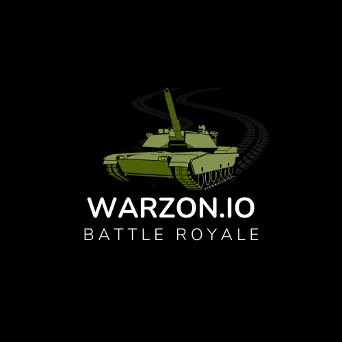

# Warzon.io
- 150 Player Battle Royale (Base Gamemode)
- 12v12 Multiplayer (Planned to release with Base Game)
- 4 Player Coop Zombie Survival (Planned to release Later)

# What is warzon.io?
Warzon.io is a 2D-based Battle Royale Game, Based on the game Call of Duty: Warzone.

### Base Game Release
#### 150 Player Battle Royale
Eleminate all Enemy Squads to win
- Warmup Area (Spawns in a certin area practicing with loadout) >3:00 Mins (Practice is over, Standby for the warzon)
- Large Map for lobbies with over 60 players
- Mini Ring for lobbies under 59 players
- Health & Armor System
- Cash System
- Stores Areas
- Loadout Drops
- Gulag System (Fight your enemy to earn your freedom) `Only allowed once per player` `Gulag closes at third to last ring`
- Queue Only In Quads `For Now`

#### Multiplayer Gamemodes
- 12v12 Team Deathmatch
- 6v6 Team DeathMatch
- Free For All 

# Features
## Loadouts
Allows players to costomize there weapons, perks, & Killstreaks(Only Multiplayer)

### Loudout Layout
- Primary (Assult Rifles, SMGs, LMGs, Sniper Rifles, Specials `Riot Shilds`)
- Secondary (Pistols, Shotguns, Rpgs, Specials `Balistic Knife` `Crossbow`)

- Grenades (Granade, Sticky Grenade, C4, Claymore, Gas Granade)
- Tacticals (Flashbangs, Stun Grenade)

#### Perk 1 `Allows you to pick 1 perk`
- Lightweight : Allows you to move faster.
- Scavenger : Replenishes your ammunition and lethal grenades when you walk over bags that are dropped by dead players. 
- Ghost : You are undetectable by the Spy Plane.
- Flak Jacket : Flak Jacket greatly reduces explosive damage and allows you to survive any indirect explosive attack.
- Hardline :  Reduces the amount of kills required for any killstreak by one. (Not avalible in Battle Royale)

#### Perk 2 `Allows you to pick 1 perk`
- Sleight of Hand : Gives a faster reload time by reducing your weapons reload time in half.
- Hardened : Increases your weapons bullet penetration againts armor.
- Scout : Decreases your hipfire recoil
- Martyrdom : Drop a live granade when killed (Not avalible in Battle Royale)

#### Perk 3 `Allows you to pick 1 perk`
- Tactical Mask : Immunity from Tacticals and Gas Grenades.
- Hacker : Allows you to see enemy explosives, equipment and Tactical Insertions.

#### Kill Streaks `Allows you to Pick 3` `Cant pick more then one with same kill count` (Not Avalible in Battle Royale)
- Spy Plane `3 Kills` : This deploys a Spy Plane that shows enemies on the radar. The map is refreshed every 3-4 seconds. The Spy Plane flies around the map and can be shot down even with your primary weapon.
- RC-XD `3 Kills` :  This killstreak allows you to remote control a small miniature car with explosives. The explosion is big enough to take out a few bad guys that are grouped together.
- Counter Spy Plane `4 Kills` : Disables the enemy radar for a short period of time, even if they don't have a Spy Plane in the air.
- Care Package `4 kills` : A slow moving Chinook brings in the package. It's possible to shoot it down more easily due to its low altitude and speed. The Care Package itself contains a random killstreak or ammo.
- Napalm Strike `5 kills` : The Napalm Strike is an airstrike that covers an area with slowly burning napalm.
- Sentry Gun `5 kills` : Airdrop a placeable Sentry Gun that attacks enemy players. It can be temporarily disabled with stun grenades.
- Artillary Strike `5 kills` : Allows you to target 3 locations on the map that will be bombarded with Mortar Strikes.
- Attack Helicopter `7 kills` : Deploys the classic Cobra Attack Helicopter to engage enemies.

## Store Items (Battle Royale Only)
Allows you to buy items in game from stores marked out on the map.
**Personal**
- Self Revive Kit `5000`
- Revive Fallen Teammates `4500`
- Armor Pack `5` `1500`
- Armor Box `3000`

**Buyable Kill Streaks**
- A10 Presision Airstrike `4500`
- Artillary Barrage `4500`
- Loadout Drop `15000`
- Personal Spy Plane `3000`
- Counter Spy Plane `3500`

